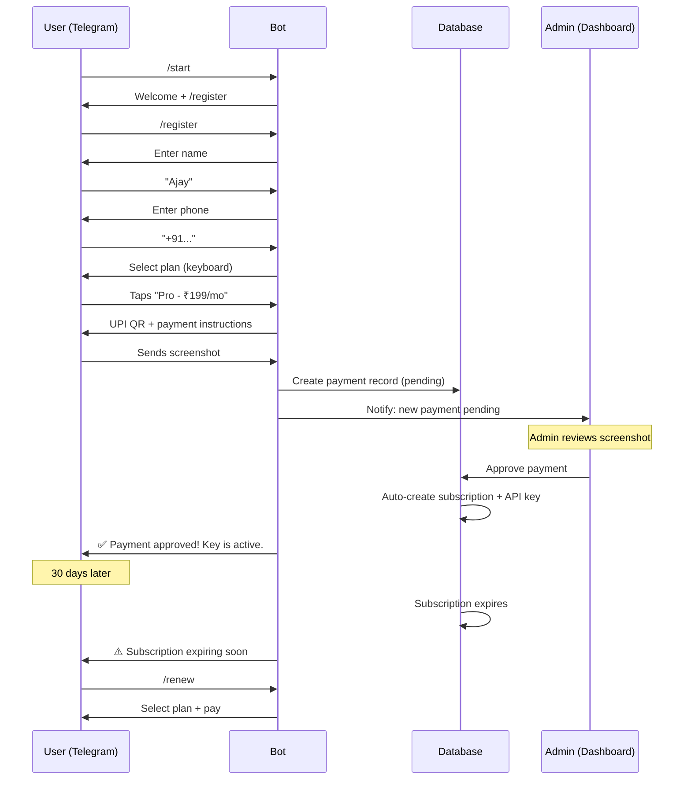

# 05b — Telegram Bot Registration & Admin Plan Management

> Part of [05-opus-final-architecture-plan.md](./05-opus-final-architecture-plan.md)

---

## Current State (What Already Exists)

After inspecting `telegram_bot.py` (1328 lines) and `payments.py`, here's what's **already built**:

### ✅ Already Working
- `/start` — Welcome message + registration prompt
- `/register` — Multi-step registration flow (name → phone → plan selection → UPI payment)
- `/my_status` — Shows user info, subscription, API key prefix
- `/my_key` — Shows API key prefix and device info
- Plan listing via Telegram inline keyboard
- UPI QR code generation for manual payments
- Payment screenshot upload + storage
- Admin payment approval/rejection via dashboard API (`/admin/api/payments/{id}/approve`)
- Auto-activation on approval: creates subscription + API key + usage cycle
- Telegram notification to user after approval

### ❌ Missing / Needs Improvement
1. **No service-level entitlements per plan** — plans only control `monthly_limit` and `duration_days`
2. **No device limit per plan** — currently hardcoded to 1 device per key
3. **No admin plan editor in dashboard** — admin routes exist but frontend panel is basic
4. **No auto-expiry scheduler** — subscriptions don't auto-expire when `end_at` passes
5. **No renewal flow** — users must re-register to renew

---

## Full User Lifecycle (Target Flow)



---

## Changes Required

### 1. Plan Service Entitlements

**Current** `SubscriptionPlan` model (`models.py:129-163`):
```python
class SubscriptionPlan(Base):
    code, name, description, monthly_limit, duration_days, price_amount, currency, is_active
```

**Add columns** via Alembic migration:
```python
# New columns on SubscriptionPlan
max_devices = Column(Integer, default=1)           # Devices allowed per key
allowed_services = Column(JSON, default={})         # {"captcha": true, "solver": true, "autofill": true}
rate_limit_rpm = Column(Integer, default=60)        # Requests per minute
rate_limit_burst = Column(Integer, default=10)      # Burst allowance
```

**Admin dashboard** already has `POST /admin/api/plans` and `PUT /admin/api/plans/{id}` — just need to pass these new fields through the existing routes.

**Frontend** `SubscriptionsPanel.jsx` needs form fields for: max_devices, allowed_services checkboxes, rate_limit_rpm, rate_limit_burst.

### 2. Service Entitlement Enforcement

**Where it's checked** (already exists): `routes.py:69-79`:
```python
def _ensure_service_allowed(request, service):
    entitlements = container.db.get_api_key_entitlements(int(key_record["id"]))
    services = entitlements.get("services") or {}
    if services.get(service) is False:
        raise HTTPException(403, "...")
```

**Change**: When creating a subscription, copy `plan.allowed_services` into the API key's entitlements:
```python
# In payment approval flow (payments.py:90-126):
if plan:
    # Set service entitlements from plan
    container.db.update_api_key_entitlements(
        key_id=new_key.id,
        services=plan.allowed_services or {},
    )
```

### 3. Device Limit Per Plan

**Current**: `UserKeyService.bind_device()` has hardcoded 1-device policy.

**Change**: Read `max_devices` from the user's active plan:
```python
def bind_device(self, api_key_id, device_fingerprint, ...):
    # Get device limit from plan
    plan_max = self._get_plan_max_devices(api_key_id)  # NEW
    
    active_count = session.query(UserApiKeyDevice).filter(
        UserApiKeyDevice.api_key_id == api_key_id,
        UserApiKeyDevice.status == "active",
    ).count()
    
    if active_count >= plan_max:
        return None  # Device limit reached
```

### 4. Subscription Auto-Expiry

**Add background task** in `main.py` lifespan:
```python
async def _subscription_expiry_loop(container):
    """Check and expire subscriptions every hour."""
    while True:
        try:
            expired = container.subscription_service.expire_overdue()
            if expired:
                logger.info(f"Auto-expired {len(expired)} subscriptions")
                # Notify users via Telegram
                for sub in expired:
                    await _notify_expiry(sub, container)
        except Exception as e:
            logger.error(f"Expiry check failed: {e}")
        await asyncio.sleep(3600)  # Every hour
```

**Add to SubscriptionService**:
```python
def expire_overdue(self) -> list[UserSubscription]:
    """Find and expire all subscriptions past end_at."""
    session = self._session()
    try:
        now = datetime.now(timezone.utc)
        overdue = session.query(UserSubscription).filter(
            UserSubscription.status == "active",
            UserSubscription.end_at < now,
        ).all()
        for sub in overdue:
            sub.status = "expired"
            sub.updated_at = now
            # Also expire user
            user = session.query(User).filter(User.id == sub.user_id).first()
            if user:
                user.status = "expired"
                user.updated_at = now
        session.commit()
        return overdue
    except Exception:
        session.rollback()
        raise
    finally:
        session.close()
```

### 5. Renewal Flow (Telegram Bot)

**Add `/renew` command** to `telegram_bot.py`:
```python
# Reuses existing plan selection + payment flow
# Difference: skips name/phone collection, jumps straight to plan picker
async def _handle_renew(self, update, context):
    user = self._get_user_by_telegram_id(update.effective_user.id)
    if not user:
        await update.message.reply_text("Not registered. Use /register first.")
        return
    # Show plan picker (reuse existing _show_plans method)
    await self._show_plans(update, context, renewal=True)
```

### 6. Expiry Warning Notifications

**Add to the expiry loop**:
```python
async def _check_expiry_warnings(container):
    """Warn users 3 days and 1 day before expiry."""
    session = get_session()
    now = datetime.now(timezone.utc)
    
    # 3-day warning
    three_days = now + timedelta(days=3)
    soon_expiring = session.query(UserSubscription).filter(
        UserSubscription.status == "active",
        UserSubscription.end_at.between(now, three_days),
    ).all()
    
    for sub in soon_expiring:
        user = session.query(User).filter(User.id == sub.user_id).first()
        if user and user.telegram_chat_id:
            days_left = (sub.end_at - now).days
            await bot.send_message(
                chat_id=int(user.telegram_chat_id),
                text=f"⚠️ Your subscription expires in {days_left} days.\nUse /renew to continue."
            )
```

---

## Admin Dashboard Plan Management (Frontend)

The backend routes already exist (`/admin/api/plans`, `PUT /admin/api/plans/{id}`). The frontend `SubscriptionsPanel.jsx` needs these additions:

### Plan Editor Fields

| Field | Type | Description |
|-------|------|-------------|
| `name` | text | Plan display name |
| `code` | text | Internal code (e.g., `basic`, `pro`) |
| `price_amount` | number | Price in paise (e.g., 19900 = ₹199) |
| `duration_days` | number | Subscription duration |
| `monthly_limit` | number | Max API calls per month |
| `max_devices` | number | Max devices per API key |
| `allowed_services` | checkboxes | captcha ✓ solver ✓ autofill ✓ |
| `rate_limit_rpm` | number | Requests per minute |
| `rate_limit_burst` | number | Burst limit |
| `is_active` | toggle | Show in Telegram plan picker |
| `description` | textarea | Shown to users |

### Service Toggles Per Key (Admin Override)

Admin should be able to override plan defaults for individual users:
- Toggle services on/off per API key
- Change device limit per key
- This already partially works via `db.update_api_key_entitlements()`

---

## Files to Change

| File | Change |
|------|--------|
| `backend/app/core/models.py` | Add `max_devices`, `allowed_services`, `rate_limit_rpm`, `rate_limit_burst` to `SubscriptionPlan` |
| `backend/migrations/versions/xxx_add_plan_entitlements.py` | [NEW] Alembic migration |
| `backend/app/services/subscription_service.py` | Add `expire_overdue()` method |
| `backend/app/services/user_key_service.py` | Read `max_devices` from plan in `bind_device()` |
| `backend/app/api/admin_routes/payments.py` | Copy `allowed_services` to key entitlements on approval |
| `backend/app/services/telegram_bot.py` | Add `/renew` command, expiry warnings |
| `backend/app/main.py` | Add background task for expiry + warnings |
| `frontend/src/app/components/SubscriptionsPanel.jsx` | Add plan editor form with all new fields |
